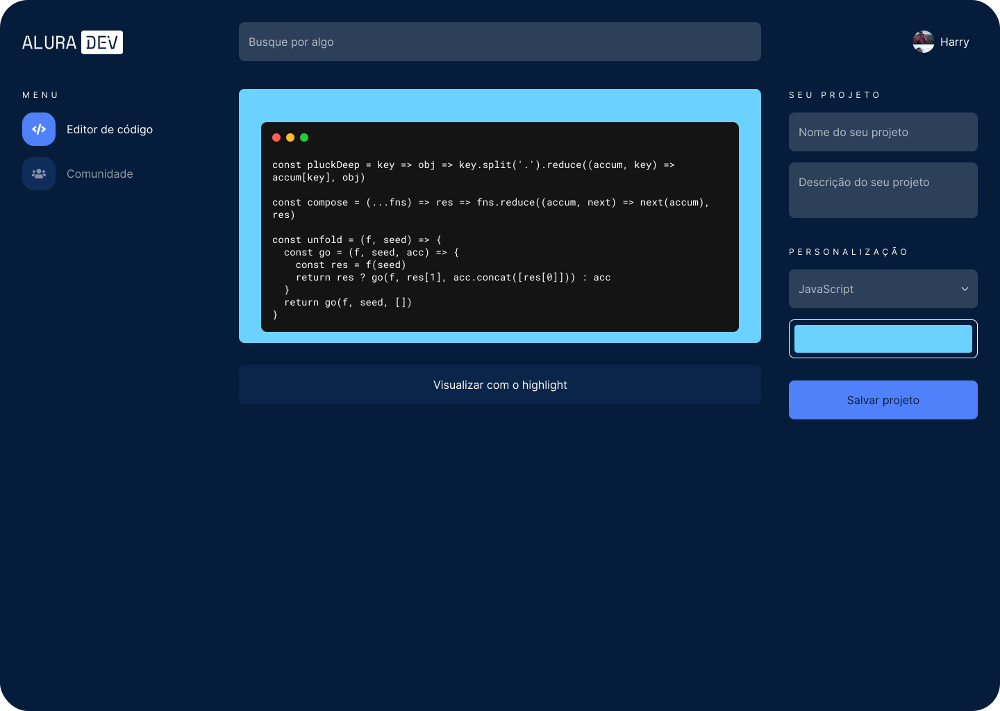
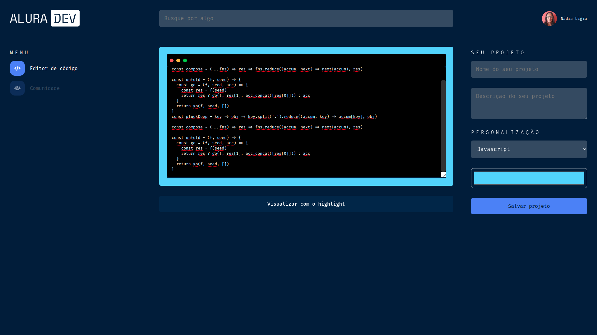

  

<h1 align="center">
  
  
  
  
  
</h1>
 

# Índice
[Sobre](#id1) 
[Layout](#id2) 
[Etapas](#id3) 
[Desenvolvimento](#id4) 
[Autora](#id99)

 

## 📌 Sobre 

Projeto desenvolvido no Alura Challenge - Front-End 1ª Edição da [Alura](https://www.alura.com.br/).

O objetivo do projeto é a construção de um editor de texto online para postar trechos de códigos nas redes sociais.

O editor precisa ter um layout acessível, simples, bonito e funcional, para que seja possível, inclusive, compartilhar a ferramenta com seus seguidores e seguidoras.

### Principais Funcionalidades
-  um campo para selecionar a linguagem a ser escrita; 
-  um campo de texto para escrever o código em si; e 
-  um botão para visualização deste código com o sintaxe highlight com um tema bem bonito.

Como esse editor é online, é de extrema importância que ele seja responsivo.

 

## 📌 Layout

  

- Para conhecer os detalhes da página, acesso o [link do Figma](https://www.figma.com/file/4EvxipXozqc5nzL0Eqt5oo/Alura-Challenge---Edi%C3%A7%C3%A3o-Front-end?node-id=207%3A1446).

 

## 📌 Etapas

- Todas as etapas estão disponibilizadas no [Trello](https://trello.com/).

- O projeto será desenvolvido em 4 etapas.

### [Etapa 1](https://trello.com/invite/b/RJK6IeDh/362b6b02e2b08a58619301c9c5cac8bb/alura-dev-etapa-01)
- Logo da plataforma
- Barra de pesquisa
- imagem do perfil de usuário com nome
- Menu de navegação
- Campo para título do projeto
- Campo para descrição do projeto
- Campo para selecionar cor de fundo do editor
- Botão para salvar projeto
- Campo para escrever o código
- Botão para adicionar syntax highlight ao código

  

### [Etapa 2](https://trello.com/invite/b/MnJq6Jug/8641b4a5da54f5caeecc2705255e7aba/alura-dev-etapa-02)
- Links do menu navegação funcionando
- Implementação do destaque de sintaxe
- Implementar a cor de fundo do editor
- Implementar micro interações na página do editor de código
- Logo da plataforma
- Barra de pesquisa
- Imagem do perfil de usuário com nome
- Cartões dos projetos salvos
- Implementar micro interações nas demais páginas

 

## 📌 Desenvolvimento

- A primeira etapa do projeto será desenvolvida em HTML e CSS.

 

## 👩‍💼 Autora

<b>Nádia Ligia, budding back-end developer.</b>

&nbsp;
&nbsp;

